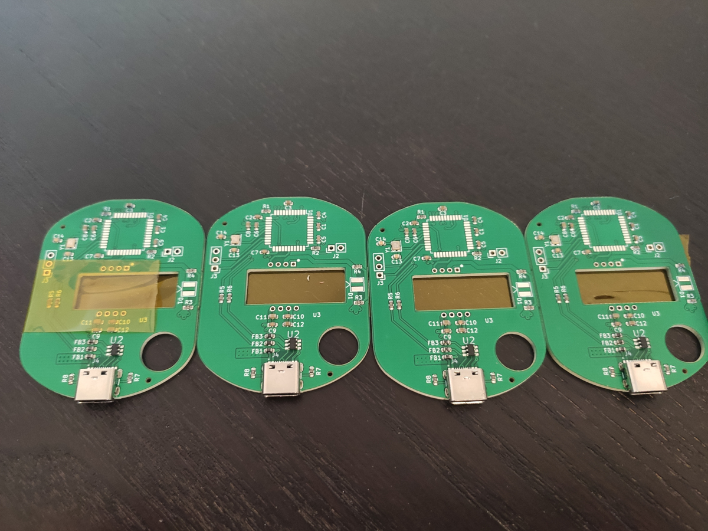
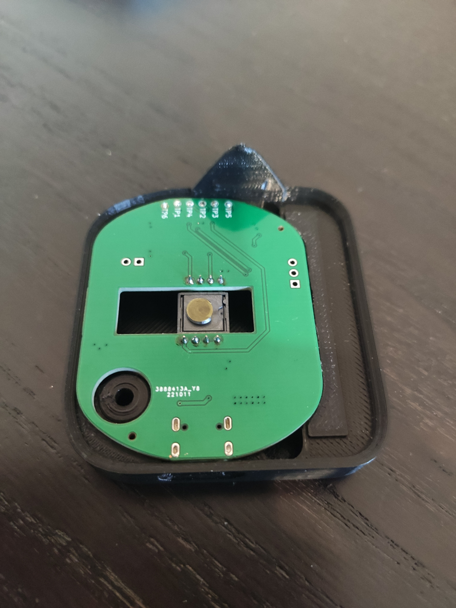
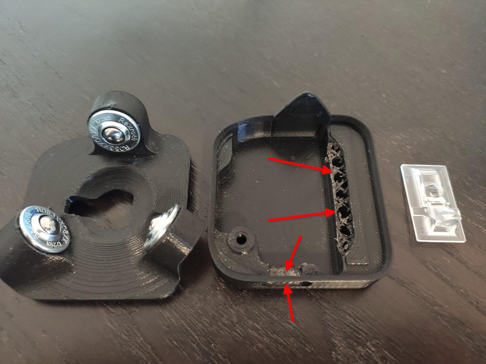
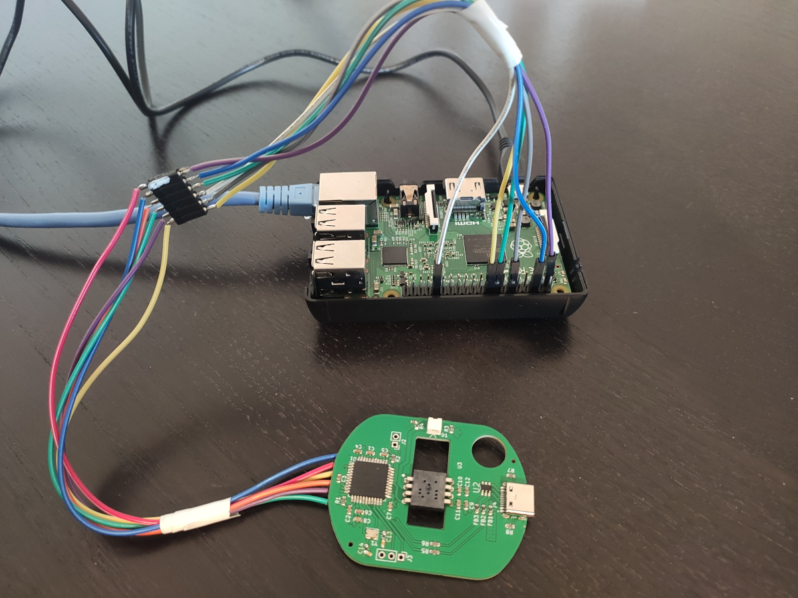
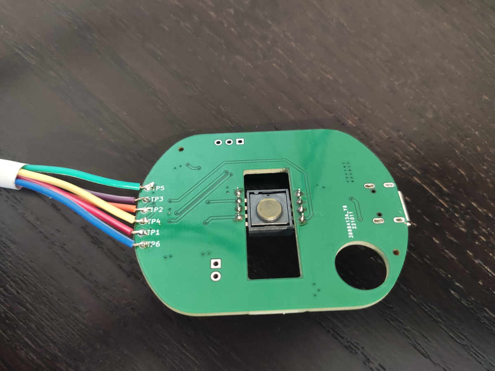

# What the final board look like?

Well first of all here are (4 out of the 5) boards I received from JLCPCB



Nothing to add here: they just look and work fine, as expected.

# Does the board fit into the 3D printed case?

Since I heavily copied the original design and placement the answer is yes, of course:



However, even though the board was OK, the 3D printed case was not at the beginning:

- the cut for the USB slot was for a microUSB, but I intentionally went for a typeC

- since I don't have a 3D printer, I had the case printed externally. It turned out that the board's holding parts were a bit too tall (so that the top part of the case was not closing properly)

Both of these problems were solved manually with the Dremel:



> The yellowish layer you see on the sensor is its original cover. I did not removed it yet because I'm still waiting for the trackball to arrive so until then I'll keep the protection on.

# Schematic fixes

Only a major fix was required compared to the original design:

- **do not mount** C13 and C14 since otherwise the oscillator does not start (verified with oscilloscope)

Then there is also another one, but this is due to the fact I was not able at all to find the ADNS-5050 component, so I replaced it with ADNS-5020 which is pin-to-pin compatible. In case you do the same then **do not install** also R3 and R4.

# How to build the FW?

You can easily download QMK firmware from its repository, checkout at the `master` branch and build it with:

```
util/docker_cmd.sh make clean && util/docker_cmd.sh qmk compile -kb ploopyco/trackball_nano/rev1_001 -km default:production
```

> Yes, I used Docker. You can run the same commands without it, but perhaps you will need to install required packages.

# How to flash the board?

Luckily there is no need for an external fancy programmer since the board can be programmed with `avrdude` using a RaspberryPi:




---
**WARNING**

In order not to uncorrectly power either the ploopy nano or the RPi, I strongly suggest to:

- disconnect the RPi from any power supply
- connect the RPi to the Ploopy
- connect power to the RPi and turn it on

---

Once you got the connection done and RPi turned on, you can SSH into it and the issue the following command to program your board:

```
sudo avrdude -p atmega32u4 -C ~/avrdude_gpio.conf -c pi_1 -v -U flash:w:ploopyco_trackball_nano_rev1_001_default_production.hex:i -U lfuse:w:0x5E:m -U hfuse:w:0x99:m -U efuse:w:0xC3:m -U lock:w:0x3F:m
```

---
**WARNING**

Of course care should be taken also when powering down:

- turn off the RPi first
- disconnect all power cables from it
- disconnect Ploopy

---